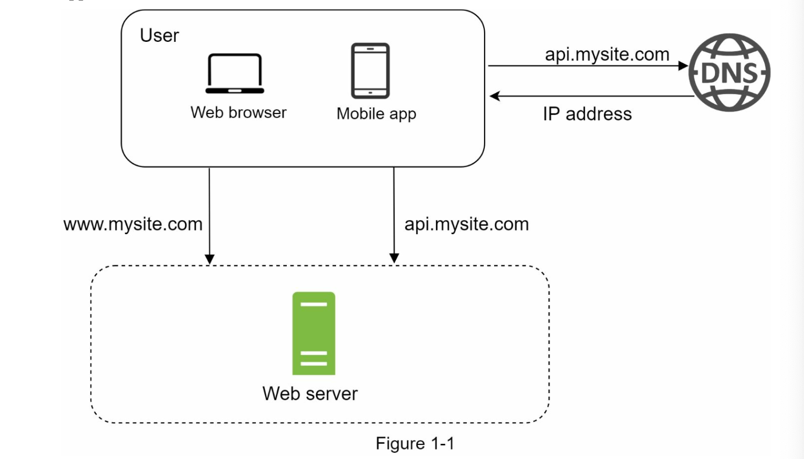
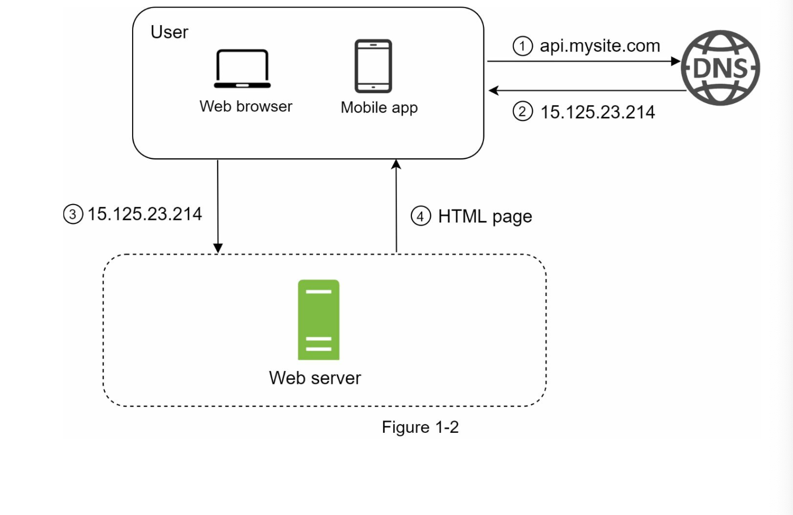
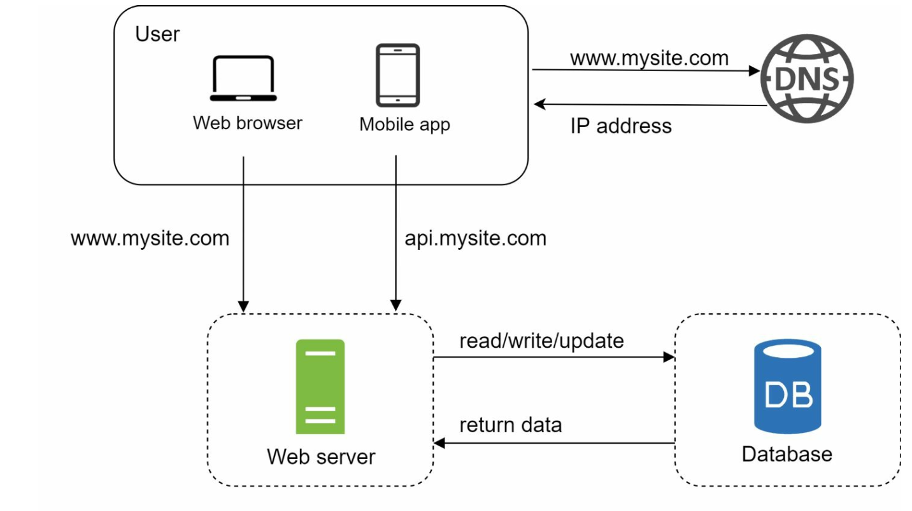
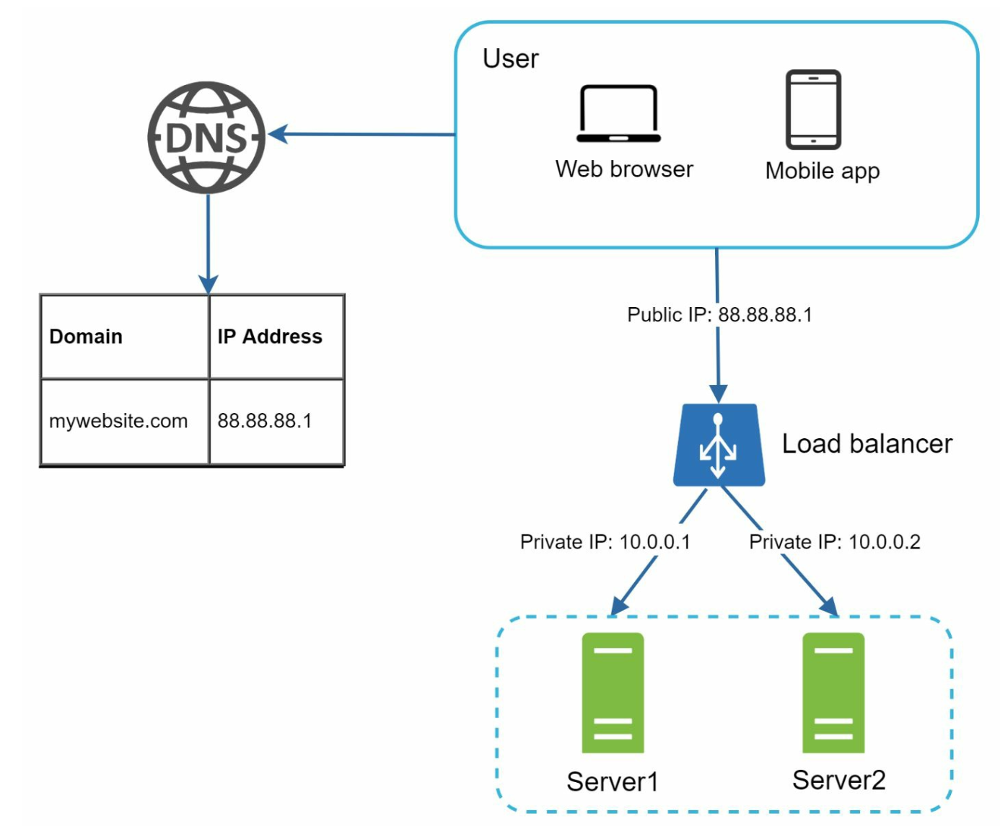
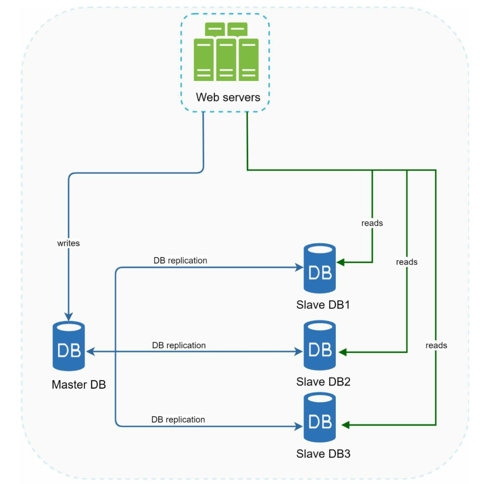

# Chapter 1 - Scale from zero to millions of users

## Single server setup

To start with something simple, let's take a look at a system where everything is running on a single server. The figure below shows a **single server setup** where everything runs on one server: web app, database, cache, etc.

To understand this setup, let's understand the request flow and traffic source:

1. A user attempts to access a website through a domain name, such as `api.mysite.com`. Usually, the Doman Name System (DNS) is a paid service provided by a 3rd party and is not hosted in our server setup.
2. The Internet Protocol (IP) address si returned to the browser or mobile app.
3. Once the client obtains the IP address, HTTP requests done by the user are sent directly to our web server.
4. Our web server returns HTML pages or a JSON response for rendering.

> **[Networking and DNS](https://github.com/jpdjere/Interviews/blob/1b3fd1a04ee5363e29853a132ca28220822e1805/Networking.md#domain-name-system-dns)**

In this case, the traffic to our web server comes from two sources: a web application and a mobile application:

- **Web app:** uses a combination of server-side language to handles business logic, storage, etc; and client side languages (HTML, CSS, JS) for visual presentation and interactivity.
- **Mobile app:** HTTP protocol is the communication protocol between the mobile app and the web server. JSON is the commonly used API response format to transfer data.

## Database

With the growth of the user base, one server is no longer enough; and we start needing multiple servers: one for web/mobile traffic and another one for the database. Separating web/mobile traffic (the web tier) and database (data tier) servers allows them to be scaled independently.

### Which databases to use?

We can choose between a traditional relational database and a non-relational database.

Relational databases are also called **relational database management system (RDBMS)** or **SQL databases**. The most popular are SQLite, MySQL, PostgreSQL, etc. They represent and store data in tables and rows. We can perform join operations using SQL across different database tables.

Non-relational databases are also called **NoSQL databases**. Popular ones are CouchDB, Neo4J (graph database), Cassandra, Amazon DynamoDB, MongoDB. Join operations are generally not supported in non-relational DBs. These databases are grouped into four categories:

- **key-value stores**
- **graph stores**
- **column stores**
- **document stores**

For most engineers, relational databases are the best option since they have been around for over 40 years, and they have historically worked well.  However, non-relational databases might be the right choice if:

- Your application requires super-low latency: NoSQL databases are designed to handle large volumes of data and provide high performance with low latency. They are more flexible and scalable than relational databases, which can be an advantage in handling unstructured data and frequent data changes.
- Your data is unstructured.
- You only need to serialize and deserialize data, such as JSON or YAML: A real-life example of an application that only requires serialization and deserialization of data is a caching system. A caching system is used to temporarily store frequently accessed data in memory or on disk, in order to reduce the latency and improve the performance of the system. In a caching system, the data is typically stored in a serialized format, such as JSON or binary, in order to minimize the storage size and maximize the retrieval speed. When a request is made for the data, the caching system retrieves the serialized data from memory or disk, deserializes it into the original data structure or object, and returns it to the client.
- You need to store a massive amount of data.

## Bandwith vs Throughput

Bandwidth and throughput are two related but distinct terms in data communication and computing systems.

**Bandwidth:**
Bandwidth refers to the maximum data transfer capacity of a communication channel or network. It is the measure of the amount of data that can be transmitted per unit of time, typically measured in bits per second (bps) or bytes per second (Bps). Bandwidth is determined by the physical characteristics of the communication channel, such as the frequency range, signal-to-noise ratio, and modulation technique. Bandwidth is an upper limit on the amount of data that can be transmitted, but it does not necessarily reflect the actual data transfer rate.

**Throughput:**
Throughput is the measure of the actual amount of data or work that can be processed, transmitted, or received in a given time frame. It is the rate at which a system can complete multiple operations or tasks. In data communication, throughput is typically measured in bits per second (bps) or bytes per second (Bps). Throughput is affected by various factors, such as latency, packet loss, and network congestion, and it is usually lower than the available bandwidth.

In summary, bandwidth is the maximum data transfer capacity of a communication channel or network, while throughput is the actual data transfer rate achieved in a given time frame. Bandwidth is an upper limit on the amount of data that can be transmitted, while throughput is the actual amount of data transmitted. Bandwidth is a theoretical value, while throughput is a measured value.

## Vertical scaling vs horizontal scaling

**Vertical scaling**, referred to as "scale up" is the process of adding more power (CPU, RAM, etc) to our servers.

**Horizontal scaling**, referred to as "scale out", is the process of scaling by adding more servers to our pool of resources.

When traffic is low, **vertical scaling** is a great option, and the simplicity of vertical scaling is its main advantage. However, it has some serious limitations:

- **It has a hard limit:** it is impossible to add unlimited CPU and memory to a single server.
- **It does not have failover and redundancy**: if the one server goes down, the website/app goes down with it completely.

**Horizontal scaling** is more desirable for alrge scale applications due to the limitations of vertical scaling. 

In the single server setup we described above, users are connected to the web server directly, and would be unable to access to the site/app if it went do. In a less dramatic scenarios, if many users access the web server simultaneously, and the web server's load limit is reached, users will experience slower responses or fail to connect to the servers.

A **load balancer** is the best technique to addresss these problems.

## Load balancer

> A load balancer is a device or software that distributes incoming network traffic across multiple servers or resources to ensure no single server becomes overwhelmed, improving reliability and performance. It is a type of reverse proxy, that recieves requests from clients and routing them to the appropriate server. Load balancers can use various algorithms, such as round robin or least connections, to determine the best server for each request. They also monitor the health of servers to avoid sending traffic to a failed or unresponsive one, and can sometimes perform SSL/TLS termination to offload encryption tasks from the servers.

----

<b>Proxy vs Reverse Proxy</b>

A reverse proxy is called so because it performs the opposite function of a traditional (or "forward") proxy. Here’s a detailed explanation of the terms and their differences:

### Reverse Proxy

A reverse proxy sits between clients and one or more backend servers. It accepts requests from clients and forwards them to the appropriate backend server. The responses from the backend servers are then sent back to the clients through the reverse proxy. This setup allows the reverse proxy to manage and distribute the load, cache content, provide security features, and handle SSL termination.

**Key Functions of a Reverse Proxy:**
- **Load Balancing:** Distributing client requests across multiple backend servers to balance the load.
- **Caching:** Storing copies of responses from the backend servers to serve future requests faster.
- **SSL Termination:** Handling SSL encryption and decryption to offload this work from the backend servers.
- **Security:** Acting as an additional layer of security, masking the backend servers and filtering potentially malicious traffic.
- **Compression:** Compressing server responses to reduce bandwidth usage.

### Forward Proxy

A traditional (or "forward") proxy, simply referred to as a proxy, sits between client devices and the internet. It takes client requests, forwards them to the appropriate internet resource, and then passes the responses back to the clients. This type of proxy is used mainly to enhance privacy, control internet access, and cache content to improve performance.

**Key Functions of a Forward Proxy:**
- **Anonymity:** Hiding the client’s IP address from the destination server.
- **Access Control:** Restricting or allowing access to specific internet resources based on policies.
- **Caching:** Storing copies of content from the internet to reduce load times and save bandwidth.
- **Logging and Monitoring:** Tracking user activity and internet usage for analysis or compliance purposes.

### Comparison: Reverse Proxy vs. Forward Proxy

- **Direction of Proxying:**
  - **Forward Proxy:** Clients → Proxy → Internet
  - **Reverse Proxy:** Internet (Clients) → Proxy → Backend Servers

- **Primary Users:**
  - **Forward Proxy:** Typically used by clients (end-users, organizations) to access the internet.
  - **Reverse Proxy:** Typically used by servers to handle incoming client requests.

- **Purpose:**
  - **Forward Proxy:** Privacy, access control, caching for client requests.
  - **Reverse Proxy:** Load balancing, security, caching, SSL termination for server responses.

The terms "forward proxy" and "reverse proxy" can indeed seem confusing at first because both involve intermediaries between clients and servers. However, the distinction lies in their primary roles and the direction of the initial request flow relative to the proxy.

### Forward Proxy
A forward proxy sits in front of clients (or client devices) and handles requests going out to the internet. 

**Flow:**
1. **Client -> Forward Proxy:** The client sends a request to the forward proxy.
2. **Forward Proxy -> Server:** The forward proxy forwards the request to the appropriate internet server.
3. **Server -> Forward Proxy:** The server sends the response back to the forward proxy.
4. **Forward Proxy -> Client:** The forward proxy sends the response back to the client.

In this case, the proxy acts on behalf of the client, masking the client's identity from the server. It is often used for purposes like anonymity, access control, and caching web resources.

### Reverse Proxy
A reverse proxy sits in front of servers and handles requests coming from clients on the internet.

**Flow:**
1. **Client -> Reverse Proxy:** The client sends a request to the reverse proxy.
2. **Reverse Proxy -> Backend Server:** The reverse proxy forwards the request to the appropriate backend server.
3. **Backend Server -> Reverse Proxy:** The backend server sends the response back to the reverse proxy.
4. **Reverse Proxy -> Client:** The reverse proxy sends the response back to the client.

In this case, the proxy acts on behalf of the server(s), masking the servers' identities from the client. It is typically used for load balancing, caching, SSL termination, and security purposes.

### Key Differences in Role and Direction
- **Forward Proxy:**
  - Acts on behalf of clients.
  - Clients know about the forward proxy and send requests to it explicitly.
  - Used mainly for client-side activities like anonymity and access control.

- **Reverse Proxy:**
  - Acts on behalf of servers.
  - Clients do not necessarily know they are interacting with a proxy; they see it as the actual server.
  - Used mainly for server-side activities like load balancing and security.

The "reverse" in "reverse proxy" refers to the reversal of roles and primary focus:
- In a forward proxy, the proxy is positioned closer to the client, managing outbound requests to servers.
- In a reverse proxy, the proxy is positioned closer to the server, managing inbound requests from clients.

So while the data flow may appear similar in both cases, the "reverse" aspect highlights the difference in which end of the client-server interaction the proxy primarily serves and manages.

----

 

A **load balancer** distributes incoming traffic evenly among web server that are defined in a load-balanced set. The figure below shows how one works:

Users connect to the public IP of the load balancer directly. With this setup, web servers are now unreachable by client directly. For better security, private IPs are used for communication between servers. A private IP is an IP address reachable only between servers in the same network, but unreachable over the internet. So, the load balancer communicates with web servers through private IPs.

In the figure above, after a load balancer and second web server are added, we have succsfully solved the no-failover issue and improved the availability of the web tier:

- If **server 1** goes offline, all traffic will be routed to **server 2**, preventing the website from going offline. This provides time to add a new healthy web server to the server pool.
- If the website traffic grows rapidly, and two servers are not enough to handle the traffic, the load balancer can handle the problem gracefully of we **add more servers to the server pool**, and the load balancer starts sending requests to them.

> **Failover vs Redundancy**
>> Failover and redundancy are two key concepts in the design of reliable and highly available systems, but they serve slightly different purposes:
>
> 1. Redundancy: This is **the duplication of critical components or systems to increase reliability.** In other words, it's the practice of having more than one piece of equipment or system that can do the same job, so that if one fails, the others can take over. This can be applied to power supplies, hard drives, servers, and even entire data centers.
> 2. Failover: This is a method of protecting computer systems from failure, in which standby equipment automatically takes over when the main system fails. **Failover is the process that happens when redundancy is put into action.** It's the mechanism that determines when a component has failed, and then switches to a redundant component.

## Database replication

While the web tier now looks good, the current design has only one database, so it does not support failover and redundancy. **Database replication** is a common techinque to address those problems.

**Database replication is the process of creating and maintaining multiple copies of a database, often in different locations, to improve data availability, reliability, and scalability.**

These copies, or replicas, are updated with the same data at the same time, or nearly the same time, to ensure that they are consistent. The replication process can be synchronous, where changes are applied to all replicas at the same time, or asynchronous, where changes are applied to one replica first and then propagated to the others.

Usually, a master database only suppots write operations, while replica databases get copies of the data from the master, and support only read operations.

All data-modyfing commands like insert, delete or update are sent to the master database. Since most application have a much higher number of read than write operations, the number of replicas in a system is usually larger than the number of master databases.

Advantages of database replication:

- **Better performance:** in a master-replica model, all write operations happen on the master node; by directing read queries to replicas, the load on the primary database can be reduced, improving the overall performance of the system.

- **High Availability and Reliability**: If one database server fails, the system can switch to a replica, ensuring that the data is still accessible.

- **Geographical Distribution**: Replicas can be located in different geographical regions to provide faster access to users in those regions and to ensure data availability in case of a regional outage.

So, what happens if one database goes offline? The architectural design in the figure above shows how such a case would be handled: